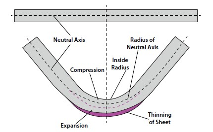

# Extrusion Path Skew

[[_TOC_]]

## Intro

In my work at the 3D printing industry, I've encountered a problem regarding the asymmetric nature of the extrusion bead around the extruder's path, along turns.

Assume we want the extrusion of some substance to reach a specific line, symmetrically around the extrusion path. This is obtained easily when the extrusion path is straight or near straight. 

However, when the path isn't straight, I've observed that the substance doesn't reach the desired line at the outside of the turns, and in the inside of the turn, the substance reaches beyond the desired line. The reason for this is explained later. 

Before I'll explain this asymmetric problem, I have to state that I couldn't find any information about this in the internet, which is  a very uncomfortable situation, because it either means I'm very wrong, or the problem I'm facing is so exotic, it doesn't matter to any but me.

At FDM 3D printing, corners are an issue, but they face bigger problems. [Corner swelling](https://www.printedsolid.com/pages/a-glossary-of-3d-printing-terms#:~:text=Corner%20swell%20occurs%20when%20excess,resulting%20in%20a%20physical%20bulge.&text=Finally%2C%20the%20force%20on%20the%20filament%20also%20factors%20into%20this.), for example.

At most precise dispensing application I've seen, such as gasketing dispensing, the dispensing path is [done inside a channel](https://www.youtube.com/watch?v=4ATPsX6vwSE) which forces the substance to stick in the right place. 

The closest I found is a problem at the world of [sheet metal bending called K-factor](https://www.thefabricator.com/thefabricator/article/bending/analyzing-the-k-factor-in-sheet-metal-bending). see picture.

There for I figured out I have to solve my problem by myself, and share my insights with the world.

## Research

After checking different assumptions, I found that the main reason is that the extrusion tip is spilling the substance blindly in a constant rate, but the outer side of the turn 'sees' the tip less time than the inner side of the turn. Therefor the area at the outer side of the turn is fed with less substance than the average, while the inner side is fed with more. And that is the main cause of the asymmetric extrusion around corners.

There's a intuitive analogy to explain to. When a car is taking a left turn, the wheels right wheels need to spin faster than the left wheels. Image if the wheels where to spin in the same speed, what would happen. That is what happens in extrusion.

In order to understand it in mathematical way, I have simulated the reach of the substrates from the extrusion path in different turn angles. And conveniently, I have found a linear relation between the reach and the angle. I'm not sure why this is, but it is good news.

How did I simulate it? I have paths with different angles, and a nozzle going along the path, and in fixed intervals, I have drawn a circle where the nozzle is. The fill color of that circle had a low alpha number, allowing the different pixels to sum to a brighter color depending on the time they 'see' the nozzle. The results are seen above in the animation.

## Solution

There are two approaches to solve this. One is to modify the extrusion amount at the turns, in order to reach the desired line. This seemed to me complicated, because I cannot predict where the modified amount of substrate would stick to eventually.

The other approach is to skew (or augment) the path so the the substrate of the modified path would reach where the original path should have. This is the approach I've selected.

## Code

In this repository, I have a sample source code that modifies the paths. 

Modifying paths is risky, and should be handled with care. Numeric stability and different point resolution are related issues.  

Assume 3 inputs

* the polygon
* a skew factor, `skewFactor`
* a window size, `window`

The way I've done it is to:

1. add sampling points to the polygon
2. per vertex
   1. find the vertex on the polygon, `window/2` away from that vertex
   2. find the vertex on the polygon, `window/2` before that vertex
   3. having those three vertices, find the angle they form
   4. move the vertex by `angle * skewFactor` away toward that angle.
3. optionally, simplify the polygon again.

The `skewFactor` I found fit is 8% of the desired extrusion width.

For any questions or comments, feel free to email me at `yoavmil at g mail dot com`.